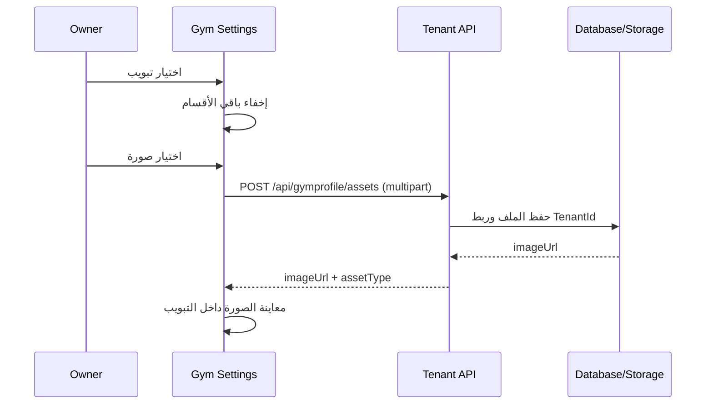

# LogicFit Gym App — دليل الشاشات والتدفقات

هذا الملف هو مرجع تشغيل الواجهة الأمامية. كل المسارات محمية بالحارس المناسب، بينما يظل الـBackend هو مصدر القرار النهائي للصلاحيات والاشتراك.

## خريطة التشغيل

```mermaid
flowchart TD
  A[فتح التطبيق] --> B[الدخول الموحد /identity/login]
  B --> C{طريقة إثبات الهوية}
  C -->|Email + Password| D[/api/identity/login]
  C -->|Phone + OTP| E[/phone-login/request ثم verify]
  D --> F{مساحات العمل}
  E --> F
  F -->|مساحة واحدة| G[دخول مباشر]
  F -->|أكثر من مساحة| H[اختيار Workspace]
  G --> I{الدور}
  H --> I
  I -->|Owner / Manager / Receptionist / Accountant| J[/owner]
  I -->|Coach / Trainer| K[/coach]
  I -->|Client| L[/client]
```

## شاشات المصادقة (`/auth`)

| المسار | الغرض | العمليات | الحالات المهمة |
|---|---|---|---|
| `/auth/login` | تحديد الجيم وتسجيل الدخول | Gym Code، الهاتف، كلمة المرور، تذكرني | تحميل الهوية، بيانات خاطئة، جيم موقوف، انتهاء الجلسة |
| `/auth/register` | إنشاء مستخدم متدرب | بيانات الحساب والجيم | تحقق الحقول ومنع التسجيل دون Tenant صالح |
| `/auth/register-gym` | بدء تسجيل جيم جديد | اسم الجيم وبيانات المالك | إنشاء Tenant ثم توجيه المالك |
| `/auth/forgot-password` | طلب كود الاستعادة | هاتف/معرف الجيم | رسالة موحدة لا تكشف وجود الحساب |
| `/auth/reset-password` | تعيين كلمة مرور جديدة | الكود وكلمة المرور | انتهاء الكود، نجاح، فشل |
| `/identity/login` | الدخول الموحد | Email + Password أو هاتف E.164 + OTP ثم السياق/المساحة | OTP منتهي/مقفل/مستهلك، أكثر من مساحة، طلبات معلقة |
| `/identity/reset-password` | استعادة الهوية | رابط بريد أو Phone + OTP | رد غير كاشف وإبطال الجلسات بعد النجاح |
| `/identity/phone-security` | تأكيد/تغيير الهاتف | Country Code، هاتف، OTP وتوقيت الإعادة | رقم مكرر/غير صالح، انتهاء، خروج بعد التغيير |
| `/identity/join` | قبول دعوة | معاينة المساحة والدور، إثبات الهوية، OTP اختياري حسب سياسة الخادم | دعوة منتهية/مستهلكة، اختلاف البريد، حد الباقة |

## لوحة المالك والإدارة (`/owner`)

| المجموعة | الشاشات | الهدف |
|---|---|---|
| Dashboard | `dashboard`, `operations` | مؤشرات الجيم، الإيرادات، الاشتراكات، التنبيهات |
| الأشخاص | `clients`, `coaches`, `membership-cards`, `gate-access` | CRUD للأعضاء والمدربين والبطاقات والدخول |
| الاشتراكات | `subscription-plans`, `subscriptions`, `attendance` | الخطط، التفعيل، التجديد، الحضور |
| المنشآت | `branches`, `rooms`, `equipment`, `maintenance` | الفروع والقاعات والأجهزة والصيانة |
| الحصص | `group-classes`, `class-schedules` | تعريف الحصص والجدولة والتسجيل |
| المالية | `invoices`, `payments`, `expenses`, `expense-categories`, `coupons`, `tax-settings` | دورة الإيراد والمصروف والفواتير |
| المخزون | `pos-sales`, `products`, `product-categories`, `stock`, `suppliers` | البيع والمخزون والموردون |
| الموارد البشرية | `employees`, `shifts`, `leaves`, `commissions`, `payroll` | الموظفون والرواتب |
| التقارير | `reports`, `advanced-reports` | تقارير قابلة للطباعة والتصدير |
| المنصة | `my-subscription`, `payment-requests` | اشتراك الجيم في LogicFit ورفع إثبات الدفع |
| الإعدادات | `profile`, `gym-settings`, `preferences` | بيانات الجيم والهوية البيضاء والتفضيلات |

### شاشة إعدادات الصالة والهوية

تعمل الشاشة الآن بتبويبات مستقلة، ويظهر محتوى التبويب المحدد فقط:

1. **الهوية والألوان:** اسم التطبيق، الخط، الألوان، دعم الجيم، خلفية الدخول وبانر لوحة التحكم، معاينة حية.
2. **بيانات الجيم:** الاسم والوصف وساعات العمل والغلاف والشعار.
3. **التواصل:** الهاتف والبريد والعنوان.
4. **التواصل الاجتماعي:** Facebook وInstagram والموقع.
5. **معرض الصور:** رفع وعرض وحذف صور الجيم.

رفع الصور يمر عبر `multipart/form-data`، يقبل JPG/PNG/GIF/WebP حتى 5MB، يعرض معاينة بعد النجاح، ويحوّل الرابط النسبي إلى رابط API كامل قبل العرض.



## شاشات المدرب (`/coach`)

`dashboard`, `trainees`, `trainees/:id`, `workout-programs`, `workout-programs/create`, `workout-programs/:id/edit`, `diet-plans`, `diet-plans/create`, `diet-plans/:id/edit`, `exercises`, `foods`, `muscles`, `measurements`, `appointments`, `chat`, `challenges`, `profile`.

كل شاشة تستخدم Tenant context من الجلسة، وتطبق صلاحية الدور على مستوى القائمة والـRoute والـAPI.

## شاشات المتدرب (`/client`)

`dashboard`, `my-program`, `workout-session`, `my-diet`, `meal-log`, `my-measurements`, `my-progress`, `my-subscriptions`, `chat`, `challenges`, `profile`.

يتم إخفاء الميزات غير الموجودة في الباقة، مع منع الوصول المباشر إليها من الـBackend وعرض رسالة ترقية مفهومة.

## حالات عامة لكل شاشة

- Loading: مؤشر تحميل دون تكرار الطلب.
- Empty: رسالة واضحة وإجراء أولي مناسب.
- Error: رسالة عربية هادئة دون كشف تفاصيل الخادم.
- Offline: الحفاظ على البيانات المدخلة وإتاحة إعادة المحاولة.
- Unauthorized: تنظيف الجلسة وإعادة الدخول.
- Responsive: RTL على العربية، LTR للحقول التقنية والروابط والأكواد.

## شاشات الهوية ومساحة المدرب الحر

- `/identity/register`: إنشاء هوية عامة بلا مساحة أو JWT، لاستخدامها في دعوات الفريق.
- `/owner/freelance-team`: دعوة مدرب/مساعد/عميل عبر طلب يخضع لموافقة Platform Admin وحدود الباقة.

| Route | المستخدم | مصدر البيانات | الحاجز التشغيلي |
|---|---|---|---|
| `/auth/register-freelance` | مدرب حر جديد | `POST /api/workspace-applications/freelance` | طلب فقط؛ الاعتماد النهائي للمنصة. |
| `/identity/login` | أي هوية عامة | Email + Password أو `/phone-login/{request,verify}` ثم اختيار مساحة أو إعادة إصدار Tracking Token | لا يصدر Tenant JWT قبل اختيار مساحة نشطة؛ Refresh Cookie غير قابلة للقراءة من JavaScript. |
| `/identity/application-status` | مقدم طلب | جلسة Tracking قصيرة العمر | يحرر الحقول المطلوبة فقط؛ لا تظهر بيانات صحية أو تدريبية. |

## عقود الهوية والصور

- `GET /api/branding/{identifier}`: الهوية العامة قبل تسجيل الدخول.
- `GET /api/gymprofile`: بيانات الجيم والهوية بعد المصادقة.
- `PUT /api/gymprofile`: تحديث البيانات والألوان والروابط.
- `POST /api/gymprofile/logo`: رفع الشعار.
- `POST /api/gymprofile/cover`: رفع الغلاف.
- `POST /api/gymprofile/gallery`: رفع صورة معرض.
- `POST /api/gymprofile/assets`: رفع أصل هوية `LoginBackground` أو `DashboardHero`.
- `DELETE /api/gymprofile/gallery`: حذف صورة معرض مرتبطة بالجيم الحالي.

> لا تعتمد الواجهة على `tenantId` من نموذج المستخدم عند تنفيذ العمليات الحساسة؛ الخادم يستخرج Tenant context من التوكن والـmiddleware.
