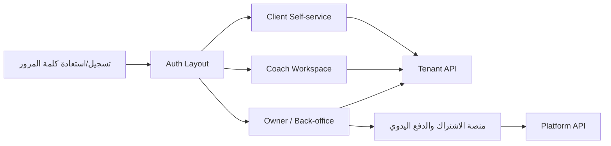

# تدفقات المستخدم ومساحات العمل

## مساحة المدرب الحر والهوية المستقلة

### Unified login entry (2026-07-30)

> **Issue #77 / Backend #292:** The login screen must receive a `200` identity context for a
> verified owner whose application is still pending, then show the application-status action and
> keep dashboard access blocked. Invalid credentials remain `401`. Backend #292 is merged; the
> Angular flow and endpoint contract are unchanged and still require a production publish.

1. The public application root redirects to `/identity/login`, a single RTL card using Email +
   Password.
2. Email calls `POST /api/identity/login`, which returns the active-workspace/pending-application
   context. For an older Active Gym with a pending owner membership, the Backend repairs only that
   owner membership before returning the context.
3. One active workspace is selected directly with `POST /api/identity/select-workspace`, even if
   another application is pending. With no active workspace and one pending application, the UI
   reissues its tracking session and opens `/identity/application-status` directly.
4. Only ambiguous responses (multiple active workspaces or multiple pending applications) show a
   compact choice list. A response with no destination returns to the login form with an inline
   message; the old `اختيار السياق`/`ابدأ باستخدام LogicFit` screen is not rendered. Registration,
   invitation, and client join remain separate flows; the frontend never creates a role or membership.
5. `/auth/login` remains an explicit legacy-gym compatibility route, not the public entry.
6. A new global identity still uses a one-time email verification link. Password recovery at
   `/identity/reset-password` uses the email-link flow.
7. Refresh Token is never stored by Angular. The backend sets an HttpOnly cookie; interceptors
   send credentials, rotate on `401`, and retain only the Access Token in JavaScript storage.

### Activation state and first-login password

The identity response includes a safe lifecycle snapshot for every pending application: workspace
type, payment, workspace, subscription, provisioning, and database status code, plus
`requiredAction`, `nextStep`, and `userMessage`. An ambiguous response can render these values as a
visible Gym/FreelanceCoach card; it never treats `Active` alone as proof that a tenant database or
membership is ready. A pending application is tracked through `/identity/application-status`, not
opened as a tenant dashboard, so loading/provisioning/failure states cannot become a blank screen.

When workspace selection returns `mustChangePassword`, the user is routed to the profile for the
actual role (`/owner/profile`, `/coach/profile`, or `/client/profile`). `authGuard` redirects any
other protected route back to that profile until the password change succeeds; the local flag is
cleared only after `POST /api/auth/change-password` succeeds.

### Workspace selection availability (Backend #294)

`POST /api/identity/select-workspace` is the server exchange that turns the short-lived selection
token into the tenant JWT. The Backend verifies the platform membership first, then resolves the
assigned tenant database before loading the local account and permissions. The Angular client must
keep the loading state visible while this request is running and handle these outcomes explicitly:

- `200`: store only the access token, keep the refresh token in the HttpOnly cookie, and continue
  to the dashboard or first-login password-change route.
- `403`: show the workspace access state (missing/inactive account or membership) and do not open
  tenant pages.
- `503` with `code=TENANT_DATABASE_UNAVAILABLE`: show the workspace-not-ready state and allow a
  retry from the login context; never render a blank dashboard or retry with a client-supplied
  database identifier.

After a successful exchange, the first dashboard request is routed by the server-side tenant
database mapping. The browser does not receive or submit connection material.

### Existing freelance application flow

1. المدرب الحر يفتح `/auth/register-freelance` ويرسل هوية المالك، معرّف المساحة، والهوية البصرية الأساسية. لا يُنشأ JWT ولا مساحة تشغيلية في هذه المرحلة.
2. ينتقل إلى `/identity/application-status` باستخدام Tracking Token قصير العمر محفوظ في جلسة المتصفح. عند `NeedsMoreInformation` لا يمكنه تعديل سوى الحقول التي طلبتها الإدارة ثم يعيد التقديم. طلبا Gym وFreelanceCoach يستخدمان حقول payload المشتركة المسموحة مثل `WorkspaceName` و`BrandName` و`Bio`؛ طلبات العضوية تستخدم `FullName` فقط. إذا كان إثبات الدفع ناقصًا يظهر حقل رفع خاص؛ يرسل الملف إلى `POST /api/workspace-applications/tracking/payment-proof` بالتوكن نفسه ثم يعيد التقديم.
3. عند انتهاء جلسة المتابعة يعود إلى `/identity/login`: الاستجابة تعيد المساحات النشطة والطلبات المعلقة معًا. يدخل مساحة نشطة واحدة مباشرة، أو يصدر جلسة متابعة جديدة لطلب واحد مباشرة؛ لا يحجب أحدهما الآخر.
4. بعد اعتماد المنصة يدخل المدرب مساحة واحدة مباشرة من `/identity/login`، ويستلم عندها Access JWT
   بينما يضع الخادم Refresh Token في HttpOnly Cookie، ثم يصل إلى لوحة المالك.
5. المدرب أو المساعد المدعو ينشئ هوية عامة من `/identity/register` بالبريد الذي سيستخدمه مالك مساحة المدرب الحر. يرسل المالك طلب انضمام من `/owner/freelance-team`، ولا يصبح العضو نشطًا قبل موافقة Platform Admin وفحص حد الباقة مرة أخرى.

### شاشة حالة التفعيل

`/identity/application-status` تعرض Timeline موحدًا من ست مراحل: الطلب، الدفع، المراجعة،
التجهيز، الاشتراك، والوصول. كل مرحلة لها حالة `done/current/blocked/pending`، مع نوع المساحة
بلون وأيقونة منفصلين (`Gym` أزرق، `FreelanceCoach` بنفسجي)، وآخر تحديث، والرسالة الحالية،
والخطوة التالية. الدفع أو `Active` وحدهما لا يفتحان لوحة الإدارة؛ الوصول يحتاج جاهزية قاعدة
البيانات والاشتراك والعضوية من الخادم. حالات الفشل أو عدم التوفر تظهر كرسالة مفهومة مع بقاء
الصفحة قابلة للتحميل، ولا تُعرض صفحة بيضاء أو Connection Material.

أثناء حالات المراجعة والتجهيز والانتظار تُعيد الشاشة قراءة الحالة تلقائيًا كل 10 ثوانٍ، مع زر `تحديث الحالة الآن`؛
حالة `NeedsMoreInformation` لا تُحدّث تلقائيًا حتى لا تُستبدل مدخلات النموذج أثناء كتابتها، وتبقى قابلة
للتحديث اليدوي.
إذا أعاد الخادم `canAccessDashboard=true` تتوقف المتابعة وتظهر رسالة نجاح وزر `الدخول إلى المنصة`؛
الزر يعيد المستخدم إلى `/identity/login` لإنشاء جلسة اختيار Workspace جديدة، لأن Tracking Token
للقراءة فقط ولا يصدر Tenant JWT. يظهر زر `العودة إلى تسجيل الدخول` في كل حالة حتى لا يظل المستخدم
عالقًا في شاشة المتابعة، ولا يحتاج إلى إنشاء طلب جديد.

## الحدود بين الواجهات

### إدارة حسابات الفريق من المالك (Issue #65)

تضيف `/owner/workspace-access` مسارًا مباشرًا لإنشاء حساب المدرب أو الموظف من داخل الجيم. النموذج
يرسل الاسم والبريد والهاتف بصيغة E.164 والدور إلى `POST /api/workspace-members`؛ الباك إند ينشئ أو
يعيد استخدام الهوية العامة، ثم يربطها بمستخدم وعضوية وصلاحيات داخل الجيم في عملية واحدة. إذا كانت
الهوية موجودة في جيم آخر فلا تُنشأ هوية ثانية، وإذا كانت العضوية موجودة في الجيم نفسه يظهر تعارض
واضح.

بعد إنشاء هوية جديدة تعرض الشاشة كلمة المرور المؤقتة مرة واحدة فقط، مع تنبيه تغييرها عند أول دخول.
تدعم الشاشة البحث والتصفية وحالات `PendingSetup`, `PasswordChangeRequired`, `Active`, `Suspended`,
`Locked`, و`Removed`، وإجراءات الإيقاف والتفعيل والإزالة وإصدار كلمة مؤقتة جديدة. لا تظهر صفحات
فارغة: التحميل، الفراغ، الخطأ، والبيانات الحساسة لها حالات مرئية مستقلة.

- **Owner** يرى كل مساحة الصالة بحسب الصلاحيات الممنوحة له.
- **Manager / Receptionist / Accountant** يستخدمون نفس Owner shell، لكن الـsidebar
  والـactions يفلتران بالصلاحيات، وليس لإخفاء الواجهة وحده أي أثر أمني.
- **Coach / Trainer** يريان عملاءهما ومواردهما المسموح بها فقط.
- **Client** يرى بياناته الشخصية وخطته واشتراكه فقط.
- تظهر أدوار `Manager` و`Receptionist` و`Accountant` و`Trainer` بتسميات واضحة داخل الرأس
  والشريط. عند `workspaceType=2` تظهر تسمية مساحة المدرب الحر بصريًا، مع بقاء الحارس والدور
  والصلاحيات كما هي.
- كل شاشة Back-office مرتبطة بحارس Permission على مستوى المسار بالإضافة إلى تصفية الشريط؛
  فتح الرابط يدويًا لا يحمل مكونًا إداريًا غير مصرح به.
- الـBackend هو الحد الأمني: الـTenant والـownership وpermission لا تعتمد على
  `TenantId` أو role قادمين من المتصفح.

## تدفق الدخول

1. يبدأ المستخدم من `/auth/login` أو `/auth/register-workspace`.
2. التسجيل الموحد يجمع نوع `Gym` أو `FreelanceCoach`، الباقة، البيانات الأساسية، وإثبات الدفع
   ثم يرسل `POST /api/workspace-applications` مرة واحدة.
3. بعد الإرسال تظهر `/identity/application-status` برسائل Submitted/UnderReview/Preparing/Ready؛
   لا تفتح الواجهة Dashboard ولا تستدعي APIs الخاصة بالـTenant قبل أن يعيد الخادم `canAccessDashboard=true`.
4. عند طلب معلومات إضافية تعدل الواجهة الحقول المطلوبة فقط ثم ترسل `PATCH .../tracking/fields`
   و`POST .../tracking/resubmit` دون إعادة التسجيل.
5. بعد `POST /api/identity/login` يعيد النظام المساحات الفعالة والطلبات المعلقة. المسار المحدد
   تلقائيًا يستخدم `POST /api/identity/select-workspace` لإصدار JWT، بينما الاختيار اليدوي لا
   يظهر إلا عند تعدد الوجهات؛ لا يعتمد الحارس على حالة قديمة في المتصفح.
6. عند `401` تتم محاولة refresh واحدة مشتركة للطلبات المتوازية؛ فشلها يخرج المستخدم. عند `402` أو
   حالة Tenant غير متاحة تُعرض تجربة اشتراك/حالة تجهيز واضحة بدل صفحة فارغة.

داخل لوحة الجيم، تتطلب لوحتا `dashboard` و`operations` صلاحية `ViewReports` التي يتطلبها
الـReports API نفسه. موظف الاستقبال الذي لا يملكها ينتقل إلى `/owner/clients`، ولا يرى رابط
التقرير أو يحصل على شاشة فارغة. شاشة فريق المدرب الحر لا تفتح من Gym حتى عند كتابة الرابط يدويًا.

## رحلة الاشتراك الموحدة (Issue #248)

المستخدم لا ينفذ خطوات تقنية بعد الإرسال. الخادم والمنصة ينشئان أو يربطان Identity، وينشئان Tenant
والاشتراك، يراجعان الدفع، يحجزان DatabaseResource من الـPool، يشغلان migrations وCanConnect وhealth
check، ثم ينشئان Owner membership ويفعلان المساحة. نوع Gym يظهر بعلامة زرقاء وأيقونة مبنى، ونوع
FreelanceCoach بعلامة بنفسجية وأيقونة مدرب في شاشة المنصة. أي نقص يظهر كحقل مطلوب فقط، وأي فشل يظهر
كـBlocked/Error واضح مع إجراء Retry آمن.

## Owner / إدارة الصالة

| المجموعة | المسارات | الصلاحية الرئيسية | الغرض والإجراء النموذجي |
|---|---|---|---|
| المتابعة | `/owner/dashboard`, `/owner/operations` | حسب تقارير المالك | KPIs، تنبيهات، ضغط الفروع، وقوائم الإجراء السريع. |
| الأعضاء | `/owner/clients`, `/owner/coaches`, `/owner/membership-cards`, `/owner/gate-access` | `ViewMembers`, `ManageMembers`, `ManageCoaches`, `ManageAttendance` | إنشاء وإدارة أعضاء ومدربين وبطاقات ودخول البوابة. |
| الاشتراكات | `/owner/subscription-plans`, `/owner/subscriptions`, `/owner/attendance` | `ManageClientSubscriptions`, `ManageAttendance` | تعريف خطط الصالة، إصدار/تجديد/تجميد/إلغاء اشتراك العميل، والحضور. |
| المرافق | `/owner/branches`, `/owner/rooms`, `/owner/equipment`, `/owner/maintenance` | `ManageBranches` | الفروع والقاعات والأجهزة وتذاكر الصيانة. |
| الحصص | `/owner/group-classes`, `/owner/class-schedules` | الصلاحية المعتمدة في الخادم | تعريف الحصص، الجدولة، الحجز وقائمة الانتظار. |
| المالية | `/owner/invoices`, `/owner/payments`, `/owner/expenses`, `/owner/expense-categories`, `/owner/coupons`, `/owner/tax-settings` | `ManageFinance` | فواتير ومدفوعات ومصروفات وكوبونات وضرائب. العمليات المالية المعتمدة لا تعدل مباشرة. |
| نقطة البيع والمخزون | `/owner/pos-sales`, `/owner/products`, `/owner/product-categories`, `/owner/stock`, `/owner/suppliers` | `ManagePOS`, `ManageInventory` | بيع، أصناف، حركات مخزون، وموردون. |
| الموظفون | `/owner/employees`, `/owner/shifts`, `/owner/leaves`, `/owner/commissions`, `/owner/payroll` | `ManageEmployees`, `ManageFinance` | شؤون الموظفين والورديات والإجازات والعمولات والرواتب. |
| التقارير | `/owner/reports`, `/owner/operations-reports` | `ViewReports` | تقارير الإدارة والتشغيل والتصدير وفق الصلاحية. |
| اشتراك الصالة بالمنصة | `/owner/subscription`, `/owner/subscription/invoices` | `ManageTenantBilling` | اختيار خطة SaaS، رفع إثبات دفع يدوي، متابعة الطلبات والفواتير. |
| الحساب والإعدادات | `/owner/profile`, `/owner/gym-settings` | `ManageSettings` | ملف المالك، بيانات الصالة، العلامة التجارية والخصائص المسموح بها. |

## Coach / المدرب

| المسارات | ما الذي يقدمه؟ |
|---|---|
| `/coach/dashboard`, `/coach/trainees`, `/coach/trainees/:id` | متابعة المتدربين المعيّنين للمدرب فقط. |
| `/coach/workout-programs`, `/coach/workout-programs/create`, `/coach/workout-programs/:id/edit` | برامج تمارين، مكتبة الحركات، وتوزيع الحمل. |
| `/coach/diet-plans`, `/coach/diet-plans/create`, `/coach/diet-plans/:id/edit` | خطط غذائية ووجبات ومغذيات. |
| `/coach/exercises`, `/coach/foods`, `/coach/muscles`, `/coach/measurements` | مكتبات التدريب والتغذية والقياسات. |
| `/coach/appointments`, `/coach/chat`, `/coach/challenges`, `/coach/profile` | التواصل والمواعيد والتحديات والملف الشخصي. |

## Client / المتدرب

| المسارات | ما الذي يقدمه؟ |
|---|---|
| `/client/dashboard`, `/client/my-program`, `/client/workout-session` | متابعة البرنامج وتسجيل الجلسة. |
| `/client/my-diet`, `/client/meal-log` | الخطة الغذائية وسجل الوجبات. |
| `/client/my-measurements`, `/client/my-progress` | القياسات والتقدم. |
| `/client/my-subscriptions`, `/client/appointments`, `/client/chat`, `/client/challenges`, `/client/profile` | الاشتراك والمواعيد والتواصل والتحديات والملف الشخصي. |

## الدفعات والاشتراك بالمنصة

الدفع في LogicFit **يدوي**. الاختيار أو التجديد لا يفعّل plan مدفوعة من الواجهة
بمفرده: يرفع مالك الصالة إثباتًا، ثم يراجع Platform Admin الطلب ويوافق أو يرفض.
حالات الاشتراك والـinvoice والـpayment request تحفظ في الخادم، والواجهة تعرضها ولا
تسمح بتحويل حالة غير مسموح بها.

## Coach-to-client plan flow (Issue #69, task branch)

1. The coach opens a client relation or the plans list. The client identifier is passed to the
   builder as a query parameter and is preselected after the assigned-client list loads.
2. The coach builds the workout or diet aggregate and saves once. The UI keeps the save button busy,
   surfaces API validation errors, and does not navigate as if a partial child save succeeded.
3. The backend checks tenant scope and the active `CoachClient` relation before writing the plan.
4. The client reads only active plans. The workout screen resumes an active session when present;
   set completion and session completion are reflected locally only after the API confirms success.
5. The diet screen reads the day's meal logs, logs every item on completion, and keeps the meal
   pending if any item fails. Unsupported/failed meal-log loading does not blank a valid plan.

### Issue #82 — FreelanceOwner after successful workspace selection

After `POST /api/identity/select-workspace` succeeds for an active freelance workspace, the
frontend retains the existing Owner identity role and uses `workspaceType=2` as the presentation
context. `/owner/dashboard` renders the coach dashboard for that context; coach routes are allowed
for the same FreelanceOwner without issuing a second login or changing the JWT role.

An optional-feature or quota response with HTTP `402` stays with the screen that requested it. The
global interceptor no longer opens the plan picker. The screen shows loading/error/retry state, and
the user can deliberately open the platform subscription screen when an upgrade is wanted.

### Issue #84 — Gym and FreelanceCoach workspace experience

1. Login and workspace selection return the selected `workspaceType` and `capabilities` snapshot.
2. `AuthService` stores that snapshot. The shell chooses `Gym Management` or `Coaching Studio`
   and the sidebar filters every item by both permission and capability.
3. A Gym owner enters the owner dashboard and keeps the complete gym navigation. A FreelanceCoach
   owner enters the coach dashboard and sees clients, programs, nutrition, progress, appointments,
   finance, reports, profile, and the limited assistant-team area.
4. A direct URL to a feature unavailable in the selected workspace is intercepted by the parent
   owner guard and routed to `/workspace-unavailable?capability=...`; no feature API is called.
5. If a stale client or another caller reaches the API, the Backend remains authoritative and
   returns HTTP 403 with `WORKSPACE_CAPABILITY_NOT_AVAILABLE`.

Switching tenants recalculates the snapshot and route surface. Tenant IDs, workspace type, and
permissions from the browser are never treated as a security boundary.

### Issue #86 — stale-session protection

When the browser contains a session created before `workspaceType` was stored, startup performs a
single tenant refresh. A valid `FreelanceCoach` response restores the coaching capabilities and
lands on `/coach/dashboard`; a missing or invalid type clears the stale session and returns the
user to `/identity/login`. The UI never falls back to Gym capabilities, and direct Gym URLs still
resolve to `/workspace-unavailable` without invoking their feature API.

### Issue #88 - sidebar workflow order

After role and capability filtering, the sidebar applies a stable workspace-specific order:

- Gym: dashboard, operations, members/coaches, memberships, attendance, facilities, group
  classes, finance, inventory/POS, reports, staff/payroll, settings, subscription, profile.
- FreelanceCoach: dashboard, clients, workout and nutrition programs, measurements, sessions and
  communication, payments and reports, assistant team, settings, subscription, profile.

This changes presentation only. It preserves the existing shared routes, capability guards,
permission checks, and backend tenant isolation. A new route not yet listed in the order map keeps
its existing relative position until it is assigned to the appropriate workflow section.
