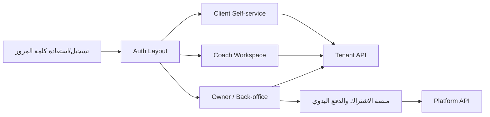

# تدفقات المستخدم ومساحات العمل

## مساحة المدرب الحر والهوية المستقلة

1. المدرب الحر يفتح `/auth/register-freelance` ويرسل هوية المالك، معرّف المساحة، والهوية البصرية الأساسية. لا يُنشأ JWT ولا مساحة تشغيلية في هذه المرحلة.
2. ينتقل إلى `/identity/application-status` باستخدام Tracking Token قصير العمر محفوظ في جلسة المتصفح. عند `NeedsMoreInformation` لا يمكنه تعديل سوى الحقول التي طلبتها الإدارة ثم يعيد التقديم.
3. عند انتهاء جلسة المتابعة يعود إلى `/identity/login`: الاستجابة تعيد المساحات النشطة والطلبات المعلقة معًا. يمكنه دخول مساحة نشطة أو إصدار جلسة متابعة جديدة لطلبه؛ لا يحجب أحدهما الآخر.
4. بعد اعتماد المنصة يختار المدرب المساحة من `/identity/login`، ويستلم عندها فقط عقد JWT/Refresh Token الحالي ويصل إلى لوحة المالك. دخول الجيم التقليدي ومساره القديم لا يتغيران.
5. المدرب أو المساعد المدعو ينشئ هوية عامة من `/identity/register` بالبريد الذي سيستخدمه مالك مساحة المدرب الحر. يرسل المالك طلب انضمام من `/owner/freelance-team`، ولا يصبح العضو نشطًا قبل موافقة Platform Admin وفحص حد الباقة مرة أخرى.

## الحدود بين الواجهات

- **Owner** يرى كل مساحة الصالة بحسب الصلاحيات الممنوحة له.
- **Manager / Receptionist / Accountant** يستخدمون نفس Owner shell، لكن الـsidebar
  والـactions يفلتران بالصلاحيات، وليس لإخفاء الواجهة وحده أي أثر أمني.
- **Coach / Trainer** يريان عملاءهما ومواردهما المسموح بها فقط.
- **Client** يرى بياناته الشخصية وخطته واشتراكه فقط.
- الـBackend هو الحد الأمني: الـTenant والـownership وpermission لا تعتمد على
  `TenantId` أو role قادمين من المتصفح.

## تدفق الدخول

1. يبدأ المستخدم من `/auth/login` أو `/auth/register`.
2. يرسل `AuthService` الطلب إلى Tenant API ويخزّن access/refresh token بأسماء
   مفاتيح البيئة فقط.
3. يختار الـguard مساحة العمل وفق الدور، ثم يمرر JWT في interceptor.
4. عند `401` تتم محاولة refresh واحدة مشتركة للطلبات المتوازية؛ فشلها يخرج المستخدم.
5. عند `402` أو حالة tenant غير متاحة تُعرض تجربة اشتراك/صالة مناسبة؛ لا يحاول
   العميل تجاوز القرار محليًا.

## Owner / إدارة الصالة

| المجموعة | المسارات | الصلاحية الرئيسية | الغرض والإجراء النموذجي |
|---|---|---|---|
| المتابعة | `/owner/dashboard`, `/owner/operations` | حسب تقارير المالك | KPIs، تنبيهات، ضغط الفروع، وقوائم الإجراء السريع. |
| الأعضاء | `/owner/clients`, `/owner/coaches`, `/owner/membership-cards`, `/owner/gate-access` | `ViewMembers`, `ManageMembers`, `ManageCoaches`, `ManageAttendance` | إنشاء وإدارة أعضاء ومدربين وبطاقات ودخول البوابة. |
| الاشتراكات | `/owner/subscription-plans`, `/owner/subscriptions`, `/owner/attendance` | `ManageClientSubscriptions`, `ManageAttendance` | تعريف خطط الصالة، إصدار/تجديد/تجميد/إلغاء اشتراك العميل، والحضور. |
| المرافق | `/owner/branches`, `/owner/rooms`, `/owner/equipment`, `/owner/maintenance` | `ManageBranches` | الفروع والقاعات والأجهزة وتذاكر الصيانة. |
| الحصص | `/owner/group-classes`, `/owner/class-schedules` | الصلاحية المعتمدة في الخادم | تعريف الحصص، الجدولة، الحجز وقائمة الانتظار. |
| المالية | `/owner/invoices`, `/owner/payments`, `/owner/expenses`, `/owner/expense-categories`, `/owner/coupons`, `/owner/tax-settings` | `ManageFinance` | فواتير ومدفوعات ومصروفات وكوبونات وضرائب. العمليات المالية المعتمدة لا تعدل مباشرة. |
| نقطة البيع والمخزون | `/owner/pos-sales`, `/owner/products`, `/owner/product-categories`, `/owner/stock`, `/owner/suppliers` | `ManagePOS`, `ManageInventory` | بيع، أصناف، حركات مخزون، وموردون. |
| الموظفون | `/owner/employees`, `/owner/shifts`, `/owner/leaves`, `/owner/commissions`, `/owner/payroll` | `ManageEmployees`, `ManageFinance` | شؤون الموظفين والورديات والإجازات والعمولات والرواتب. |
| التقارير | `/owner/reports`, `/owner/operations-reports` | `ViewReports` | تقارير الإدارة والتشغيل والتصدير وفق الصلاحية. |
| اشتراك الصالة بالمنصة | `/owner/subscription`, `/owner/subscription/invoices` | `ManageTenantBilling` | اختيار خطة SaaS، رفع إثبات دفع يدوي، متابعة الطلبات والفواتير. |
| الحساب والإعدادات | `/owner/profile`, `/owner/gym-settings` | `ManageSettings` | ملف المالك، بيانات الصالة، العلامة التجارية والخصائص المسموح بها. |

## Coach / المدرب

| المسارات | ما الذي يقدمه؟ |
|---|---|
| `/coach/dashboard`, `/coach/trainees`, `/coach/trainees/:id` | متابعة المتدربين المعيّنين للمدرب فقط. |
| `/coach/workout-programs`, `/coach/workout-programs/create`, `/coach/workout-programs/:id/edit` | برامج تمارين، مكتبة الحركات، وتوزيع الحمل. |
| `/coach/diet-plans`, `/coach/diet-plans/create`, `/coach/diet-plans/:id/edit` | خطط غذائية ووجبات ومغذيات. |
| `/coach/exercises`, `/coach/foods`, `/coach/muscles`, `/coach/measurements` | مكتبات التدريب والتغذية والقياسات. |
| `/coach/appointments`, `/coach/chat`, `/coach/challenges`, `/coach/profile` | التواصل والمواعيد والتحديات والملف الشخصي. |

## Client / المتدرب

| المسارات | ما الذي يقدمه؟ |
|---|---|
| `/client/dashboard`, `/client/my-program`, `/client/workout-session` | متابعة البرنامج وتسجيل الجلسة. |
| `/client/my-diet`, `/client/meal-log` | الخطة الغذائية وسجل الوجبات. |
| `/client/my-measurements`, `/client/my-progress` | القياسات والتقدم. |
| `/client/my-subscriptions`, `/client/chat`, `/client/challenges`, `/client/profile` | الاشتراك والتواصل والتحديات والملف الشخصي. |

## الدفعات والاشتراك بالمنصة

الدفع في LogicFit **يدوي**. الاختيار أو التجديد لا يفعّل plan مدفوعة من الواجهة
بمفرده: يرفع مالك الصالة إثباتًا، ثم يراجع Platform Admin الطلب ويوافق أو يرفض.
حالات الاشتراك والـinvoice والـpayment request تحفظ في الخادم، والواجهة تعرضها ولا
تسمح بتحويل حالة غير مسموح بها.
